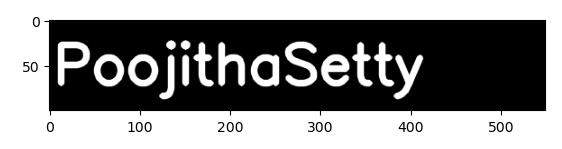
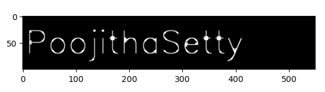
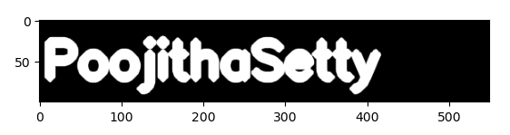

# Implementation-of-Erosion-and-Dilation
## Aim
To implement Erosion and Dilation using Python and OpenCV.
## Software Required
1. Anaconda - Python 3.7
2. OpenCV
## Algorithm:
### Step1:
Import the necessary packages.


### Step2:
Create the Text using cv2.putText.

### Step3:
Create the structuring element.

### Step4:
Erode and Dilate the image.

### Step5:
End Program.

 
## Program:
```
Developed By:POOJITHASETTY
Register Number:212221240050
```
### Import the necessary packages
```
import cv2
import numpy as np
from matplotlib import pyplot as plt
```
### Create the text using cv2.putText
```
img1 = np.zeros((100,550), dtype = 'uint8')
font = cv2.FONT_HERSHEY_SIMPLEX
cv2.putText(img1,'PoojithaSetty',(5,70), font, 2,(255),5,cv2.LINE_AA)
plt.imshow(img1,'gray')
```
### Create the structuring element
```
kernel = cv2.getStructuringElement(cv2.MORPH_CROSS,(7,7))
cv2.erode(img1, kernel)
```
# Erode the image
```
image_erode1 = cv2.erode(img1,kernel)
plt.imshow(image_erode1, 'gray')
```
# Dilate the image
```
image_dilate1 = cv2.dilate(img1, kernel)
plt.imshow(image_dilate1, 'gray')
```

## Output:

### Display the input Image


### Display the Eroded Image


### Display the Dilated Image


## Result
Thus the generated text image is eroded and dilated using python and OpenCV.